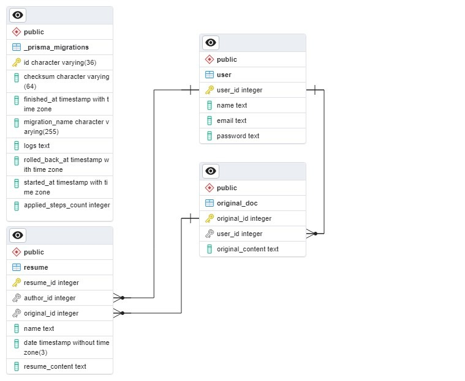

This is a [Next.js](https://nextjs.org/) project bootstrapped with [`create-next-app`](https://github.com/vercel/next.js/tree/canary/packages/create-next-app).

## **Table of Contents**

1. [Introduction](#1-introduction)
2. [System Architecture](#2-system-architecture)
3. [API Structure](#3-api-structure)
    1. [Authentication Module](#31-authentication-module)
    2. [User Module](#32-user-module)    
4. [Database](#4-database)
    1. [Prisma & PostgreSQL](#41-prisma--postgresql)
5. [Getting Started](#5-getting-started)
6. [Learn More](#6-learn-more)
7. [Deploy on Vercel](#7-deploy-on-vercel)

---

## **1. Introduction**
The Lawyer AI API is a cutting-edge web application designed for legal professionals and individuals looking to streamline the process of reviewing and enhancing legal contracts, including employment contracts, agreements, and more. With Lawyer AI, you can easily upload a contract and receive a summary, detailed feedback, and suggestions for improvements.

---

## **2. System Architecture**


The provided diagram gives a comprehensive overview of the system's architectural design, highlighting the flow and integration of various technologies and components. Here is a detailed breakdown:

### **Clients:**
- **Frontend:** Represents external entities interacting with our API. They make HTTP requests to manage user authentication and obtain PDF files with contract summaries.

### **External APIs:**
- **ContractRevise Tech:** The ContractRevise Tech API is the main external tool, leveraging the power of artificial intelligence and machine learning to expedite and enhance the contract review process, saving time for legal professionals and ensuring contracts are robust and clear.

### **Main Backend Application: Next.js API:**
Next.js is chosen for its ease of use. The application consists of various modules:

- **Summary Module:** This module stores client summaries in the local database and provides endpoints for clients to access their summary history.
  
- **User Module:** This service handles user management, including endpoints for user registration and retrieval of user details.
  
- **Authentication Module:** The authentication module is integral to securing the application. It provides endpoints for user registration, login, token updates, and logout, ensuring that only authorized users can access specific resources. JWT is used for token-based authentication.

### **Database Interaction – Prisma ORM:**
- **Prisma:** An open-source database toolkit that allows seamless interactions with the PostgreSQL database. With Prisma, operations like data retrieval, update, and deletion become simpler, eliminating the need for complex SQL queries.

### **Database – PostgreSQL:**
- **PostgreSQL:** A powerful open-source relational database system. Given its extensibility and standards compliance, it's an excellent choice for our authentication and summary data storage.

**Key Interactions:**
1. Clients make requests to the Next.js API.
2. For summaries, the API fetches summaries from ContractRevise Tech and sends them to the database when initializing the Summary module.
3. User-related requests, such as registration or login, involve interactions with the User and Authentication modules. After authentication, JWT tokens are issued for secure subsequent interactions.
4. All database interactions, whether data retrieval or update, are handled through Prisma ORM, ensuring efficiency and security.

---

## **3. API Structure**


### **3.1. Authentication Module**

This module is crucial for registering, logging in, and logging out users. Additionally, it facilitates token updates. The use of tokens ensures a secure and stateless authentication mechanism.

### **3.2. User Module**

This module is responsible for user management. Functions include:

- Finding users by email or ID.
- Creating new users.
- Managing refresh tokens.

---

## **4. Database**

### **4.1. Prisma & PostgreSQL**

Prisma serves as an open-source database toolkit, providing an Object-Relational Mapping (ORM) layer for the API, simplifying interactions with the database. PostgreSQL is employed as the primary database, chosen for its reliability and comprehensive feature set.

**Key Tables:**

1. **user**:
   - Purpose: Manage user data and authentication data.
   - Columns:
     - `id`: Unique identifier.
     - `name`: User's first and last name.
     - `email`: User's email address.
     - `password`: Hashed password for security.     

2. **resume**:
   - Purpose: Store created summaries.
   - Columns:
     - `id`: Unique identifier.
     - `name text`: Summary file name.
     - `date`: Creation date.
     - `resume_content text`: Text of the created summary.    

3. **original_doc**:
   - Purpose: Store uploaded original documents.
   - Columns:
     - `id`: Unique identifier.
     - `original_content text`: Text of the original document.    



---

## **5. Getting Started**

1. Clone the repository 

  ```bash 
  git clone git@github.com:Fedreric/Lawyer-AI.git
  ```

2. Install dependencies

  ```bash 
  cd Lawyer-AI
  yarn install
  ``` <br>
  
  ```bash 
  cd Lawyer-AI
  npm install
  ``` 

3. Configure the .env file

  ```bash
  cp .env.example .env
  ```

<br>
  
DATABASE_URL="postgresql://[postgres]:[PASSWORD]@[host:5433]/DB.NAME?schema=public" <br>
NEXTAUTH_URL="http://localhost:3000/" <br>
NEXTAUTH_SECRET="GCDg7ffgPAjIh0+EFnqN7yvLhKkKWCGK08pfjn6wO6s="<br>

Make sure to provide real values for [postgres], [PASSWORD], and DB.NAME in the DATABASE_URL configuration. Additionally, note that the value of NEXTAUTH_SECRET should be generated using the

```bash
openssl rand -base64 32
``` 
 command or a similar method.


4. Set up the local database using docker-compose

  ```bash
  docker-compose up
  ```

5. Run migrations with Prisma

  ```bash
  npx prisma migrate dev
  ```

6. Start the API

  ```bash
  yarn start
  ```
<br>

  ```bash
  npm run dev
  ```
---

Open [http://localhost:3000](http://localhost:3000) with your browser to see the result.

You can start editing the page by modifying `app/page.js`. The page auto-updates as you edit the file.

This project uses [`next/font`](https://nextjs.org/docs/basic-features/font-optimization) to automatically optimize and load Inter, a custom Google Font.

---

## **6. Learn More**

To learn more about Next.js, take a look at the following resources:

- [Next.js Documentation](https://nextjs.org/docs) - learn about Next.js features and API.
- [Learn Next.js](https://nextjs.org/learn) - an interactive Next.js tutorial.

You can check out [the Next.js GitHub repository](https://github.com/vercel/next.js/) - your feedback and contributions are welcome!

---

## **7. Deploy on Vercel**

The easiest way to deploy your Next.js app is to use the [Vercel Platform](https://vercel.com/new?utm_medium=default-template&filter=next.js&utm_source=create-next-app&utm_campaign=create-next-app-readme) from the creators of Next.js.

Check out our [Next.js deployment documentation](https://nextjs.org/docs/deployment) for more details.
