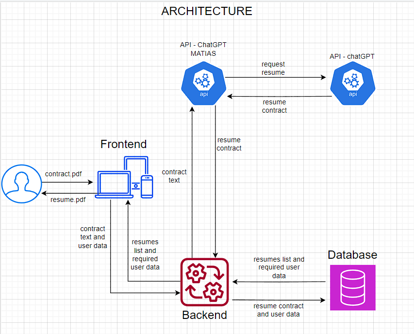
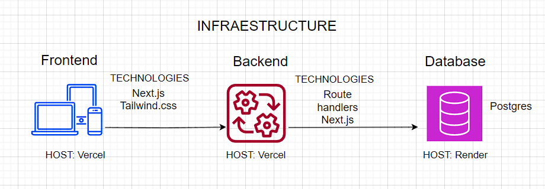
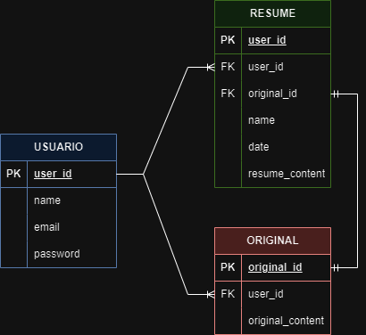

# LAWYER AI

## **Table of Contents**

1. [Introduction](#1-introduction)
2. [System Architecture and Structure](#2-system-architecture-and-structure)
3. [Features](#3-features)
4. [Getting Started](#4-getting-started)
5. [Future Improvements](#5-future-improvements)
6. [Acknowledgments](#6-acknowledgments)

---

## **1. Introduction**

The LAWYER-AI API is developed to control and manage current contracts in a simpler way. We enable the average user to quickly access the LAWYER AI app and attempt to summarize a contract using our latest developed technology. We also handle user authentication. You get data about the dates of your generated summaries and can access them easily and quickly. We are transforming the way legal professionals review and enhance contracts. Technologies used include Next.JS, Prisma for interactions with the database, and bcrypt for encryption.

---

## **2. System Architecture and Structure**

1. System Architecture
   - The user sends the PDF file to the Frontend service.
   - We receive the text from the Frontend.
   - The text and user data are sent to the Backend.
   - The entered text is summarized in the database, and the list of summaries and required user data is sent back to the Backend.



2. API Structure



3. Database

PostgreSQL was used based on the following relational diagram:



---

## **3. Features**

1. When accessing the landing page, you will find a navbar that can lead you to log in.
2. There is a brief advertisement about who we are and how to get your first account or access as a registered user on the left side of the screen.
3. In the center of the screen, you can see a button that allows you to upload your .PDF file to start testing the application.
4. In the center of the screen, you can see a button that allows you to send your file to our database to perform your intelligent summary.
5. In the registration section, you will find the necessary fields to create a valid user and log in easily.
6. In the login section, you will find the necessary fields to create a valid user and log in easily.
7. In the summary section, you will find the same field as our landing page but with an additional feature. The main advertisement transforms into an accessible history of all your summaries.

---

## **4. Getting Started**

1. Clone the repository

```bash 
git clone git@github.com:Fedreric/Lawyer-AI.git
```

2. Install dependencies

```bash 
cd Lawyer-AI
npm install
```

3. Configure the .env file

```bash
cp .env
```

```bash
$ openssl rand -base64 32
# This creates random code for Linux users / example [NEXTAUTH_SECRET="your-secret-code"]
```

Configure the .env file as follows:

```bash
DATABASE_URL="postgresql://[postgres]:[PASSWORD]@[host:5432]/DB.NAME?schema=public"
NEXTAUTH_URL="http://localhost:3000/"
NEXTAUTH_SECRET="your-nextauth-secret"
SECRET_JWT="your-JWT-secret"
OPENAI_API_KEY="your-apikey-openai"
``` 

4. Configure the local database using Prisma

```bash 
npx prisma migrate dev
```

## **5. Future Improvements**

- Incorporate user-friendly styles
- Add unit tests for each module
- Implement reading of WORD file formats.
- Implement a live demonstration of the API using the Railways application

---

## **6. Acknowledgments**

We appreciate the developers/tutors who guided us on this journey to build this app through their advice and contributions to the knowledge of the implemented technologies.<br>
We thank the documentation provided by Next.js.<br>
We thank the documentation provided by Prisma.<br>
We thank the documentation provided by PostgreSQL.<br>
We thank the YouTube channels that helped us understand from a broader perspective how to reach the final result.<br>
We appreciate the institutions that trained us and provided the space to implement the knowledge provided.<br>
We thank GitHub for allowing us to publish our APP to facilitate our collaborative work and future developers to improve any weaknesses or strengths the application currently has.<br>
We appreciate the space provided on Discord by Global-Learning and Not-Nini, allowing us to carry out this new project.<br>
We thank the team members for their participation and time dedicated to the development and implementation of all technologies.<br>

## **Team Members:**
- [https://github.com/canogerman](https://github.com/canogerman)
- [https://github.com/Fedreric](https://github.com/Fedreric)
- [https://github.com/AgustinCNz](https://github.com/AgustinCNz)